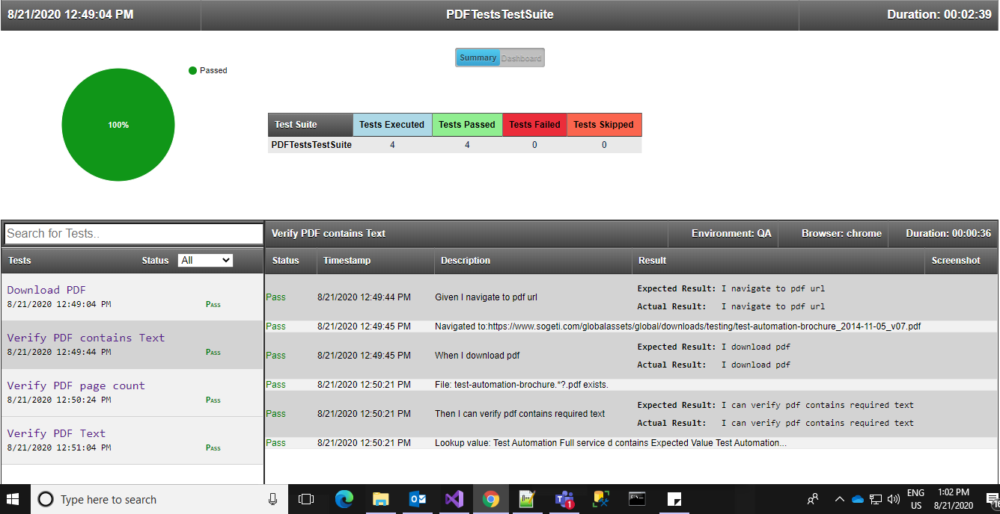

# Selenium-C#-PDF-Tests
PDF Tests using Selenium, C# and Specflow

### Usage
Install-Package Test.Automation.Framework -Version 1.0.0.5

### Features
 ■ Download PDF as file
 
 ■ Download PDF as web page
 
 ■ Read PDF file from web
 ■ Read PDF file stored on hard disk
 ■ Verify text contents from PDF file
 ■ Get PDF file page counts
 ■ Delete PDF files

### Interesting stuff: Scenario execution [HTML Reports](https://github.com/SandeepDhamale19/Selenium-PDF-Tests/tree/master/TestAutomation.PDFTests/Results)
##### A. Test Suites: Summary [All passed]
 <kbd></kbd>
 <!---->

 
